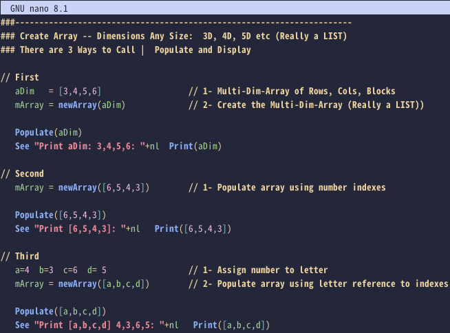

## [Ring](https://github.com/ring-lang/ring) syntax highlighting for nano

### How to install?

1. Create .nano dir if it's not existing
```bash
mkdir -p ~/.nano
```
2. Download [ring.nanorc](https://raw.githubusercontent.com/ysdragon/ring-nano/main/ring.nanorc) file to ~/.nano
```bash 
wget -O ~/.nano/ring.nanorc https://raw.githubusercontent.com/ysdragon/ring-nano/main/ring.nanorc
```
3. Add this line to ~/.nanorc
```bash
include "~/.nano/ring.nanorc"
```

### Demo

